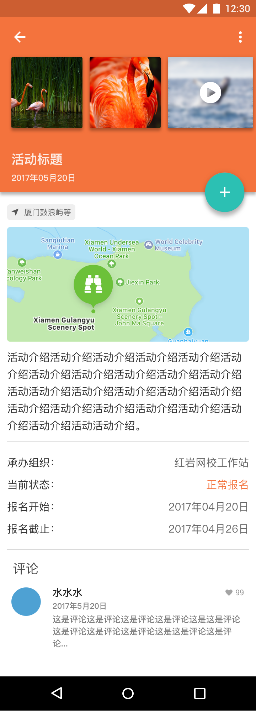

# CommunityFairs
社团活动宣传报名平台。采用MVVM+DataBinding+Anroid Architecture Components 构建项目。采用 RxJava封装Retrofit 进行网络请求的线程调度，统一错误处理和进度条显示控制的转换器，利用 OkHttp 拦截器做缓存策略。BindingAdapter实现控件相关事件处理封装，隔离UI层。

##Screenshot

